# Thermal Image Processing

Welcome to the Thermal Image Processing Flask Application! This project implements various image processing features tailored for thermal images.

## Interface Screenshots

## Implemented Features

1. **Thresholding:**
   - Segmentation of thermal images based on temperature thresholds.
     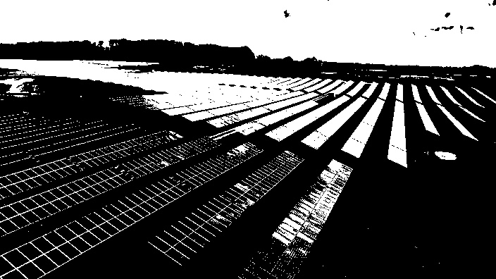

2. **Contour Detection:**
   - Identification and tracing of contours in thermal images for object recognition.
     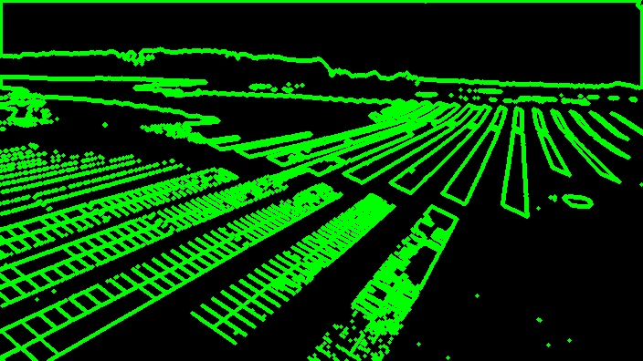

3. **Edge Detection:**
   - Highlighting boundaries in thermal images to emphasize temperature transitions.
     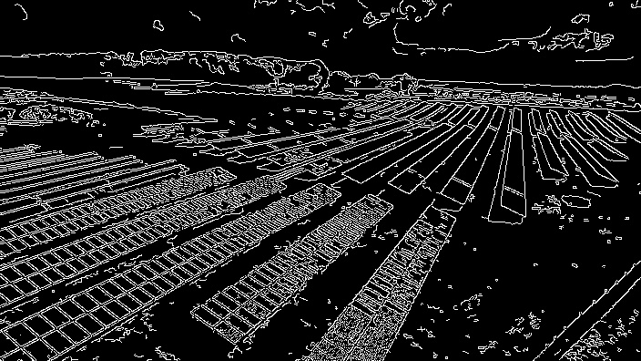

4. **Histogram Equalization:**
   - Contrast enhancement to improve visibility of details in thermal images.
     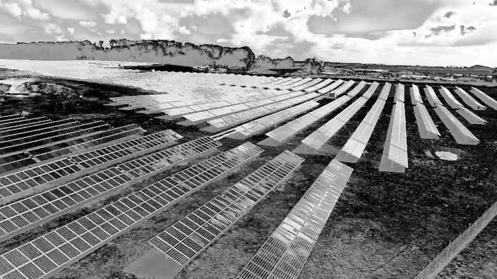

5. **Noise Reduction:**
   - Reduction of noise in thermal images for clearer representation of temperature patterns.
     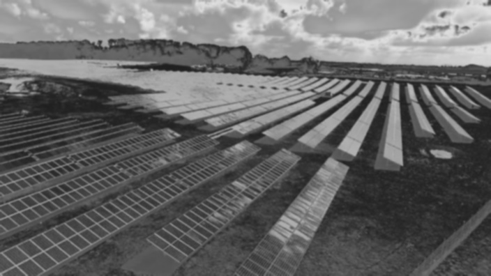

6. **Color Mapping:**
   - Application of color mapping techniques to grayscale thermal images for enhanced visualization.
     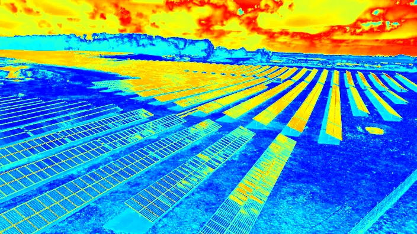

7. **Erosion and Dilation:**
   - Morphological operations for modifying thermal image structures, useful for feature extraction.
     - Erosion:
     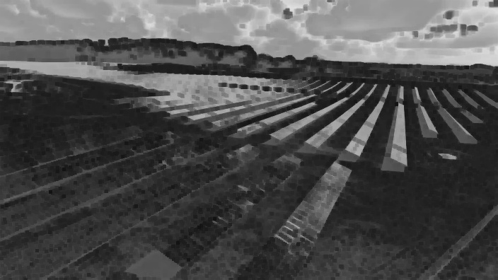
     - Dilation:
     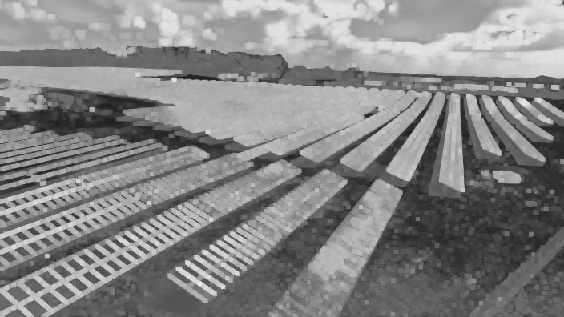

8. **Bilateral Filtering:**
   - Smoothing of thermal images while preserving temperature variations.
     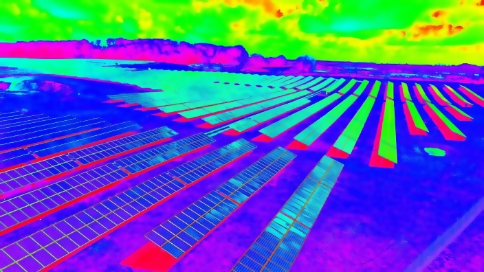

9. **Hough Circle Detection:**
   - Identification of circular patterns in thermal images using the Hough transform.
     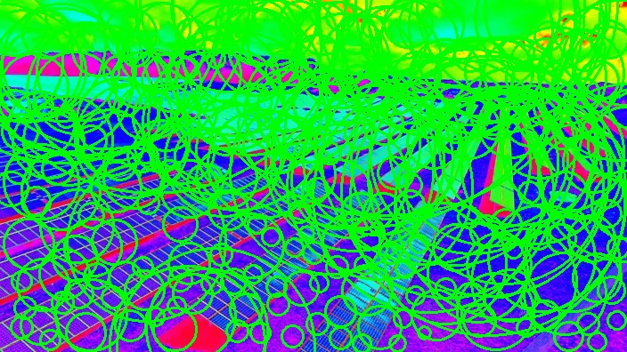

10. **GrabCut Segmentation:**
    - Precise segmentation of thermal images into foreground and background for accurate analysis.
      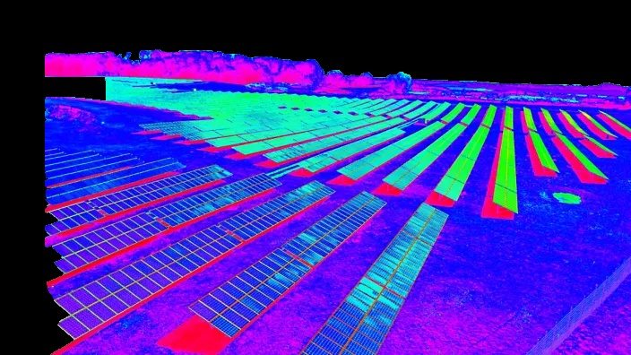

11. **Corner Detection:**
    - Detection of temperature change points in thermal images using corner detection algorithms.
      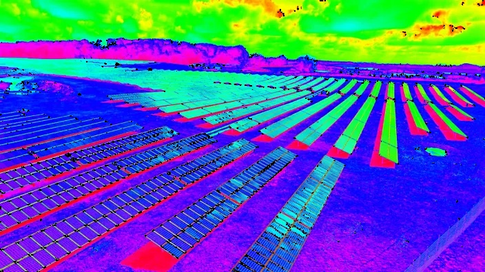

12. **Local Binary Pattern (LBP):**
    - Description of local temperature patterns for texture analysis in thermal images.
      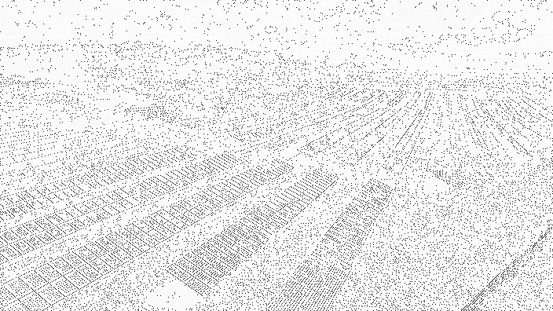

13. **Sharpening:**
    - Enhancement of fine temperature details in thermal images for improved clarity.
      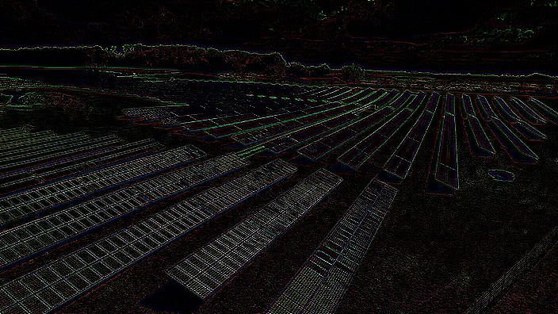

14. **Log Transformation:**
    - Adjustment of pixel intensity values using the logarithm function to reveal subtle temperature differences.
      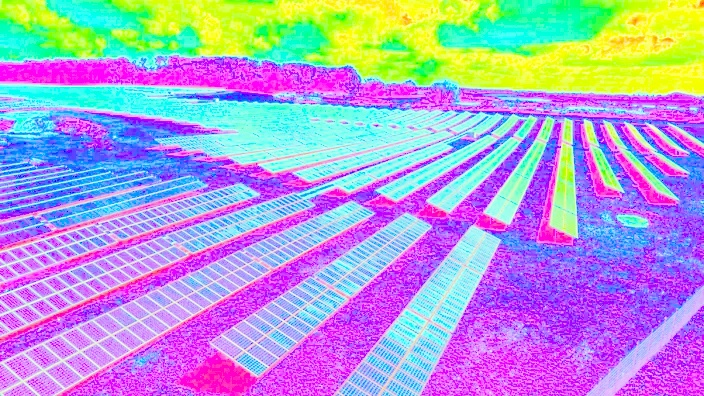

## Usage

To experience these features, follow these steps:

1. Clone the repository:

   ```bash
   git clone https://github.com/your-username/Thermal-Image-Processing.git
   cd Thermal-Image-Processing

2. Install Dependencies
   ```bash
   pip install -r requirements.txt
3. Run Flask application
   ```bash
   python app.py
Visit http://localhost:5000 in your web browser and upload a thermal image to see the implemented features 

Feel free to explore, contribute, and enhance thermal image processing. Happy coding!
